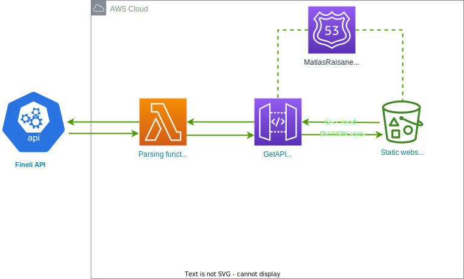

# solidabis-koodihaaste-2022

Coding challenge for Solidabis //
[Solidabis koodihaaste 2022](https://koodihaaste.solidabis.com/intro)

*Should the above URL be unavailable or updated, check [this snapshot](https://web.archive.org/web/20221011125550/https://koodihaaste.solidabis.com) on the Wayback Machine from 11-Oct-2022*

I took the liberty of only using English in the project, as I felt it to be more fitting as a human interface language than Finnish.

## Introduction
The objective of this project is to take part in Solidabis CodeChallenge 2022.

In it, the developer must create a fullstack application, in which a user can select two foodstuffs to "fight" each other.

The application must:
1. Retrieve nutritional contents of foodstuffs from a 3rd party source
2. Transform nutritional contents into character attributes
3. Have logic that allows two foodstuffs to duel each other
4. Present the duel results as an API response, or visually on the front end

## Infrastructure

## Back end

The backend is hosted on Amazon Web Services.
The infra is built and deployed using AWS Cloud Development Kit ([AWS CDK](https://aws.amazon.com/cdk/)), which lets the developer define the infrastructure as code. The benefit here is that making changes to deployed infrastructure is easy, as it can be done through code and using a slow GUI is unnecessary.

## Front end

Front end is a simple react app, which implements [Material UI](https://mui.com/) components.
It is also hosted on AWS as a static website on an S3 Bucket.

## How it works?

On the front end, the user will type a food into a search box and press "submit".

The frontend will then call API Gateway, which will forward the request to a lambda function, which will in turn call **Fineli foods API** with the requested food. The lambda function will then transform the nutritional contents received into character stats, and return them to the frontend.

Once the user has selected two combatants, they will press "begin" to start the fight.
The frontend will then use simple maths to calculate the winner of the food fight, and display the results to the user.

### Stats logic

The resulting food from Fineli API has different values for its ingredients, depending of the preparation method and food type.  
We will use the following conditions to find its most unprocessed form:

`response[i].type.code = "FOOD"`  
&&  
`response[i].preparationMethod[0].code = "RAW"` 

If these conditions cannot be met, we will fall back to just any value we can pull out.

### Fight logic

| Stat | Value | Notes | 
| ----------- | ----------- | ----------- |
| HP | Energy (kcal) | Total health points
| ATTACK | Carbs (g) | Damage per strike
| DEFENCE (%) | Protein (g) | Mitigates incoming damage by a percentage. 1g = 1%
| COOLDOWN | Protein(g) + Carbs(g) + Fats(g) | Amount of seconds to wait after each strike. The higher the value, the slower the fighter
| DPS | ATTACK * (100% - ENEMY_DEFENCE) / COOLDOWN | Damage per second is used to calculate which fighter runs out of HP first
| SECONDS_TO_WIN | ENEMY_HP / DPS | The amount of seconds it takes for a combatant to defeat its opponent |

The combatant with the lower score in `SECONDS_TO_WIN` is the winner!

To avoid the fights taking too long, the outcome is pre-calculated and shown to the user after a 3-second pseudo fight :-)

## Final notes

I would like to take part in the koodihaaste-competition.  
I am also open for interesting job offers **:-)**

You can contact me at [matias@matiasraisanen.com](mailto:matias@matiasraisanen.com)
