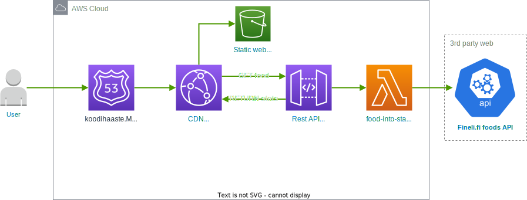

# Solidabis Koodihaaste 2022

Solidabis code challenge 2022 //
[Solidabis koodihaaste 2022](https://koodihaaste.solidabis.com/intro)

_Should the above URL be unavailable or updated, check [this snapshot](https://web.archive.org/web/20221011125550/https://koodihaaste.solidabis.com) on the Wayback Machine from 11-Oct-2022_

Live demo @ [koodihaaste.matiasraisanen.com](https://koodihaaste.matiasraisanen.com/index.html)

## Introduction

The objective of this project is to take part in Solidabis code challenge 2022.

In it, the developer must create a fullstack application, in which a user can select two foodstuffs to "fight" each other.

The application must:

1. Retrieve nutritional contents of foodstuffs from a 3rd party source
2. Transform nutritional contents into character attributes
3. Have logic that allows two foodstuffs to duel each other
4. Present the duel results visually on the front end

This application is hosted on AWS, and available at [koodihaaste.matiasraisanen.com](https://koodihaaste.matiasraisanen.com/index.html)  
_Unless I have taken it down..._

I took the liberty of only using English in the project, as I felt it to be more fitting as a human interface language than Finnish. Fighter names (food items) will be Finnish though. Here's a little list of fighters to try out.

| EN      | FI       |
| ------- | -------- |
| apple   | omena    |
| carrot  | porkkana |
| tomato  | tomaatti |
| potato  | peruna   |
| sausage | makkara  |

---

## Infrastructure



## Back end

The backend is hosted on Amazon Web Services.
The infra is built and deployed using AWS Cloud Development Kit ([AWS CDK](https://aws.amazon.com/cdk/)), which lets the developer define the infrastructure as code. The benefit here is that making changes to deployed infrastructure is easy, as it can be done through code and using a slow GUI is unnecessary.

## Front end

Front end is a simple react app, which implements [React Bootstrap](https://react-bootstrap.github.io/) components.
It is also hosted on AWS as a static website on an S3 Bucket.

## How it works?

- On the front end, the user will type a food into a search box and press "submit".

- The frontend will call API Gateway, which will forward the request to a lambda function
- The lambda function will call **Fineli foods API** with the requested food.
- Fineli responds with an array of all the items it found in its database.
- The lambda function will then try to find the food item in its most unprocessed form, and return its nutritional stats to the front end.

  ```json
  {
    "statusCode": 200,
    "message": "success",
    "data": {
      "name": "Omena, ulkomainen, kuorineen",
      "energy": 38.852571462547175,
      "carbohydrate": 8.19540006637573,
      "protein": 0.165299997925758,
      "fat": 0.087000001296401,
      "cooldown": 8.447700065597887
    }
  }
  ```

- If no unprocessed version can be found, we will just fall back to the first item in the list.

- Once the user has selected two combatants, they will press "begin" to start the fight.
- The frontend will then use simple maths to calculate the winner of the food fight, and display the results to the user.

### Stats logic

The resulting food from Fineli API has different values for its ingredients, depending of the preparation method and food type.  
We will use the following conditions to find its most unprocessed form:

```javascript
item.type.code = "FOOD" && item.preparationMethod[0].code = "RAW"
```

If these conditions cannot be met, we will fall back to just the first item in the list.

### Fight logic

| Stat        | Value                                   | Notes                                                                                                                                   |
| ----------- | --------------------------------------- | --------------------------------------------------------------------------------------------------------------------------------------- |
| HP          | energy (kcal)                           | Total health points                                                                                                                     |
| ATTACK      | carbs (g)                               | Damage per strike                                                                                                                       |
| DEFENCE (%) | protein (g)                             | Mitigates damage from an incoming strike by a percentage. 1g = 1%                                                                       |
| COOLDOWN    | protein + carbs + fats = cooldown (sec) | Amount of seconds to wait after each strike. The higher the value, the slower the fighter. This is an internal stat, not shown to user. |
| DPS         | ATTACK / COOLDOWN                       | Damage per second. Not used for logic, but a nice to know stat                                                                          |
| SPEED       | 1 sec / COOLDOWN                        | Attack speed. Number of attacks per second                                                                                              |

To avoid the audience getting bored of slow fights, the fights will be carried out at 10x speed :-)

## Deployment

The application is deployed to AWS via steps listed in [deploy.sh](./deploy.sh)

If you want to deploy the application, you have to change the deploy script to use your own AWS credentials, and also purchase a domain name to be used with the deployment.

## Final notes

I would like to take part in the koodihaaste competition.  
I am also open for interesting job offers **:-)**

You can contact me at [matias@matiasraisanen.com](mailto:matias@matiasraisanen.com)
